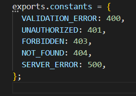

# Node.js ve MongoDB ile RESTful API Oluşturma

Kendimi geliştirmek için video kaynaktan yararlanarak, Node.js ve MongoDB kullanarak temel "GET, POST, DELETE" işlemleri yapabilen bir RESTful API oluşturdum.

## Araçlar
- MongoDb
- Node.js 
- mongoose
- JavaScript 
- Postman 
## Görseller
controllers>contactController.js

##
middleware>errorHandler.js

##
constants.js

